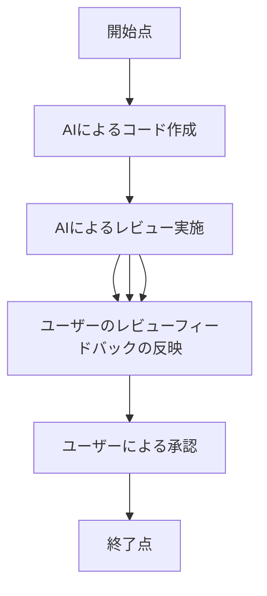

# コードレビューガイドライン

## コードレビューの目標

コードレビュープロセスにおける私たちの優先目標は、{バグの発見 | コードベースの安定性とメンテナンス性 | 知識移転・共有 | メンタリング | 記録の保持・作成} です。

コードレビュープロセスで実現したいこと：

💡コードレビュー中は常に、協力的で、敬意を持ち、建設的なトーンであることを推奨します。開発者ではなく、コードに焦点を当てましょう！　何よりも、親切にしてください。

## 私たちのツール／プラットフォームとワークフロー

コードレビューを円滑に進めるために、{AI} を使用します。チームでこのツールを選んだ理由は、開発者が一人だけなのですが、コードレビューのベストプラクティスを維持し、コード品質を確保するためです。

### 私たちのワークフロー

私たちの通常のコードレビューのワークフロー：

**ワークフローの詳細なステップ**

1. 開始点
2. AIによるコード作成
3. AIによるレビュー実施
   - AIがコードをレビューし、潜在的な問題を特定する
   - 本ファイルの「私たちのレビューの焦点」に基づいてレビューを行う
4. AIによるレビューフィードバックの反映
5. ユーザーにレビューを依頼
   - PRの作成などは不要で、AIはそのままチャット上から依頼可能
6. ユーザーのレビューフィードバックの反映
   - ユーザーはチャットでフィードバックを返し、AIは必要に応じてコードを修正する
7. ユーザーによる承認
8. 終了点

### 依頼者の責務

- **自分自身が最初のレビュー担当者になる**：レビュー担当者がどのような質問をするかを予測し、事前に回答する。コードの変更が十分にテストされ、フォーマットが統一され、チームのコーディング規約に従っていることを確認する
- **あなたは、あなたのコードではない**: エゴを捨てる
- **自分自身やレビュー担当者ではなく、フィードバックに焦点を当てる**：レビュー担当者からのフィードバックを受け入れて、迅速に対応し、ブロッキング問題は24時間以内に解決するように努める

### レビュー担当者の責務

- **エゴを捨てる**
- **開発者ではなく、コードに焦点を当てる**
- **建設的なフィードバック**：小さな、または自明なフィードバックには、コメントを使用する。客観的で具体的、そして結果重視であることを確認する。大きな、あるいは複雑なフィードバックの場合は、コメントを通じてではなく、PR作成者と直接話し合うこと
- **この役割で与えられた影響力を濫用しない**：24時間以内、または可能な限り早くレビューを完了するように努める。代替アプローチや改善点を提案する場合は、事実に基づいて裏付けする
- **徹底的にレビューする**：レビューをどれだけ徹底したかどうかにかかわらず、あなたのレビューを通過するものは、あなたの責任となる

## 私たちのガイドライン

これらのガイドラインは、コードレビュープロセスで何をすべきか、そしてそれをどのように行うべきかを定めています。これらは、チームとプロセスを軌道に乗せ、レビューに対して私たち全員が合意した期待事項に、チームの方向性を揃えるためのものです。

### 私たちのレビューの焦点

コードレビュー時に焦点を当てるべき主要な項目は、次の通りです:

- **複雑さ**：コードは理解可能か？　わかりやすいか？　将来、ほかの開発者（またはコードの元の作成者自身）が再びこのコードを見たときに、依然として明確に理解できるか？　コードをより「人に優しく」、わかりやすくできる余地はないか？　将来、このコードに変更を加えることはできるか？　より恒久的な対応が必要な「ワークアラウンド」や「一時的な」コードはないか？
- **整合性**：提案された変更は、すでに機能し、信頼性が高く、確立されたプロジェクト内の設計パターンやプラクティスに従っているか？　既存のコードやライブラリを再利用できないか？
- **規約**：業界全体の規約を守っているか？　コードは、ライブラリ、フレームワーク、プログラミング言語、その他の確立された規約に従っているか？
- **クロスプラットフォーム互換性**：コードベースは、クロスプラットフォーム互換性を考慮する必要があるか？　プラットフォームに依存しない依存関係で構成されているか？　ほかの開発者がこのコードを「そのまま」実行するのに苦労するか？
- **ドキュメント**：ドキュメントが不足している場合に承認を止めるか？（そうあるべきだと思う！）　関連ドキュメントの更新は、PRのチェックリストに含まれるか？　コード内の説明コメントは、ドキュメントとしてカウントされるか？　技術的、ユーザー向け、アーキテクチャ用など、異なる形式のドキュメントを区別しているか？　もしそうなら、コードレビュー中に対処すべきドキュメントはどれか？
- **エラー処理**：エラーと例外の処理に関する明確なガイドラインはあるか？　それらは、コードベース全体で一貫して実装されているか？　未対応のエッジケースはないか？
- **命名**：チームに命名規則がある場合、それに従っているか？　変数、メソッド、関数、クラス、その他の主要部分は、明確で理解しやすいか？　多言語チームの場合はどうだろうか？　命名規則に関してどの程度厳格になり、どのルールがワーキングアグリーメントに追加するほど重要か？
- **リソース管理**：（メモリ、ネットワーク接続、入出力操作などの）リソースの管理は、適切に考慮されているか？
- **拡張性**：コードは、大きなリグレッションを起こさずに、リファクタリングや書き直しできるか？　将来、少し異なるシナリオに対応できるか？
- **セキュリティ**：自動化された手段では検出されない明らかなセキュリティの脆弱性はあるか？　あなたが所属する業界で課せられているセキュリティ基準で、遵守できていないものはあるか？
- **テスト**：テストが不足している場合に、承認を止めるか？　コードカバレッジをただ増やすだけのテストも許容されるか？　テストがなくても許容されるシナリオはあるか？

レビュー担当者として、私たちは上記の問題に注意を払うことを優先すべきです。

## ブロッキング問題 vs 非ブロッキング問題

次のリストは、タスク進行を止める**べき**問題（ブロッキング問題）と、タスク進行を止める**べきではない**問題（非ブロッキング問題）で構成されています。リストにない問題に直面した場合は、チームで議論しましょう。

### ブロッキング問題

機能やセキュリティ、メンテナンス性に影響を与える問題。承認前に作成者が対処する必要がある問題。タスク進行を止めることができる問題。

- **重要な機能**：説明や受け入れ基準に記載された意図した機能を満たしていない
- **セキュリティの問題**：個人情報や機密データが漏洩したり、システムを危険にさらしたりする危険性のある脆弱性を含んでいる
- **コーディング規約違反**：コードが、チーム、プロジェクト、スタイルガイドやガイドラインから大きく逸脱している
- **コードの臭い**：構造や可読性がよくなかったり、アンチパターンが含まれていたりする
- **リグレッション**：予期しない副作用を引き起こしたり、既存の機能を壊したりしている
- **パフォーマンス問題**：パフォーマンスやリソースの使用に悪影響を及ぼしている
- **テストの失敗**：コードの変更により、既存のテストが失敗している

### 非ブロッキング問題

機能やセキュリティ、メンテナンス性に影響を与えない問題。タスク進行を止めるべきでない問題。別のストーリーやマイナーアップデート、建設的なフィードバックを通じて解決できる問題。

- **スタイルの好み**：自分の好みとは異なるコードスタイル
- **軽微なフォーマットの不一致**：一貫性のないスペースやインデントなどの些細な問題
- **ドキュメントの細かい指摘**：ドキュメント内の些細な不整合や誤字脱字、不一致
- **任意の機能の欠如**：PRが主要な機能を満たしているものの、ついでに言及された任意の機能がない場合
- **軽微なリファクタリングの機会**：機能に影響せず、別のPRで対処できるコードの改善
- **無関係な改善**：元のPRと関連せず、別のPRで対処できる提案

## 承認ポリシー

ここでは、**承認できる人**について説明します。

### 承認者リスト

メインリポジトリに直接貢献し、そのリポジトリに少なくとも「書き込み」権限を持つ人が承認者になることができます。

**必須の**レビュー担当者として追加された場合、タイムリーにレビューすることが求められます。

### 承認数

**1人**（以上）の承認が必要です。作成者は自身のコードを承認できません。
